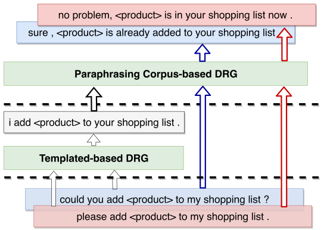
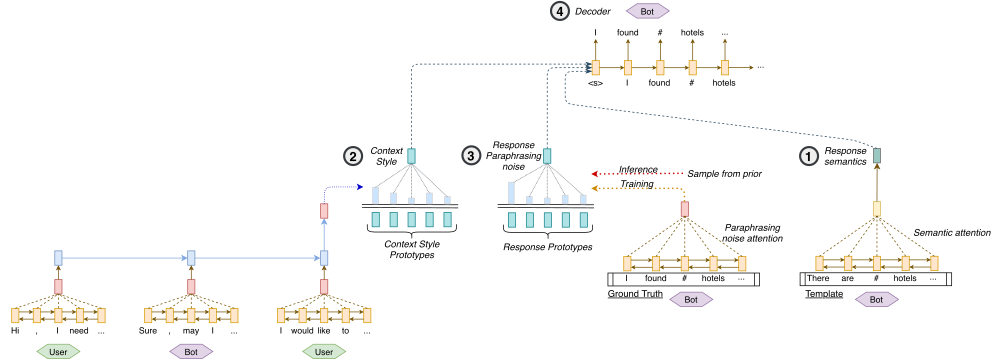

# Diversifying Task-Oriented Dialogue Response Generation with Prototype Guided Paraphrasing

Authors: _Phillip Lippe, Pengjie Ren, Hinda Haned, Bart Voorn, and Maarten de Rijke_

## Paper summary

Access to information is increasingly conversational in nature.
Task-oriented Dialogue Systems (TDS) aim to help users achieve a specific task through conversations, e.g., booking a flight.
Dialogue Response Generation (DRG) is one of the core TDS components; it translates system actions (e.g., `request(phone)`) into natural language responses (e.g., Can I have your phone number, please?).
  
Existing methods for DRG in TDS can be grouped into two categories: template-based and corpus-based.
The former prepare a collection of response templates in advance and fill the slots with system actions to produce system responses at run-time.
The latter generate system responses token by token by taking system actions into account.
While template-based DRG provides high precision and highly predictable responses, they usually lack in terms of generating diverse and natural responses when compared to (neural) corpus-based approaches.
Conversely, while corpus-based DRG methods are able to generate natural responses, we cannot guarantee their precision or predictability.
Moreover, the diversity of responses produced by today's corpus-based DRG methods is still limited.

<p align="center">
  </br>
  <i>Combining a template- and corpus-based dialogue system</i>
</p>

We propose to combine the merits of template-based and corpus-based DRG by introducing a prototype-based, paraphrasing neural network, called P2-Net, which aims to enhance quality of the responses in terms of both precision and diversity.
Instead of generating a response from scratch, P2-Net generates system responses by paraphrasing template-based responses.
To guarantee the precision of responses, P2-Net learns to separate a response into its semantics, context influence, and paraphrasing noise, and to keep the semantics unchanged during paraphrasing.
To introduce diversity, P2-Net randomly samples previous conversational utterances as prototypes, from which the model can then extract speaking style information.
We conduct extensive experiments on the MultiWOZ dataset with both automatic and human evaluations.
The results show that P2-Net achieves a significant improvement in diversity while preserving the semantics of responses.

<p align="center">
  </br>
  <i>Visualization of P2-Net with its three components for (1) semantic, (2) context influence and (3) paraphrasing noise</i>
</p>


## Running experiments

### Requirements

This code is written in PyTorch. Any version later than 1.3 is expected to work with the provided code. Please refer to the [official website](https://pytorch.org/) for an installation guide.

We recommend to use conda for installing the requirements. If you haven't installed conda yet, you can find instructions [here](https://www.anaconda.com/products/individual). The steps for installing the requirements are:

1. Create a new environment
   ```setup
   conda create env -n P2Net
   ```
   In the environment, a python version >3.6 should be used.
   
2. Activate the environment
   ```setup
   conda activate P2Net
   ```
   
3. Install the requirements within the environment via pip:
   ```setup
   pip install -r requirements.txt
   ```

### Training

To train P2Net, run the following script:
```
python train_unsupervised.py
```
The hyperparameters are set to the default values used in our experiments. To see an overview of all hyperparameters, run:
```
python train_unsupervised.py --help
```

### Evaluating a model

To evaluate a model, we provide three scripts: `eval_context_prototypes.py`, `eval_diversity.py` and `eval_style_retrieval.py`. All the three scripts evaluate a different aspect of the model, and can be run by providing a checkpoint. See the individual scripts for details.

## Contributing
All content in this repository is licensed under the MIT license.

### Citation

```
@article{lippe2020diversifying,
  title={Diversifying Task-oriented Dialogue Response Generation with Prototype Guided Paraphrasing},
  author={Lippe, Phillip and Ren, Pengjie and Haned, Hinda and Voorn, Bart and de Rijke, Maarten},
  journal={arXiv preprint arXiv:2008.03391},
  year={2020}
}
```
